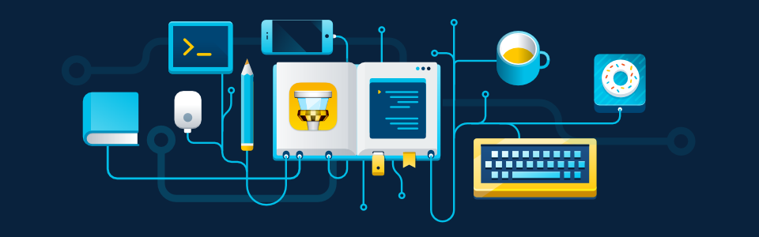

<!-- Banner Image -->

# Hi there! 👋 I'm Samuel Reutcky  
I'm a **software developer in training**, currently studying at MITT. I love learning new programming languages and exploring the endless possibilities of technology.  

---

## About Me  
- 📚 Constantly learning and improving my skills  
- 🖥️ Building web development projects as part of my studies  
- 🦎 Proud gecko owner and pet lover  
- 🌱 Exploring different programming languages and technologies  

---

## My Projects  
- [Shape Factory](https://mr-reutcky.github.io/shape-factory/)  
- [Gondola Pizza Payroll](https://mr-reutcky.github.io/gondola-pizza-payroll/)  
- [Fakebook](https://mr-reutcky.github.io/fakebook/)  
- [Word Game](https://mr-reutcky.github.io/word-game/)  
- [Guessing Game](https://mr-reutcky.github.io/guessing-game/)  

Check out all my projects [here](https://github.com/Mr-Reutcky?tab=repositories).  

---

## Technologies I'm Learning  
          

---

## My GitHub Stats  
 

---

💻 *Let's connect and build something amazing!*  
